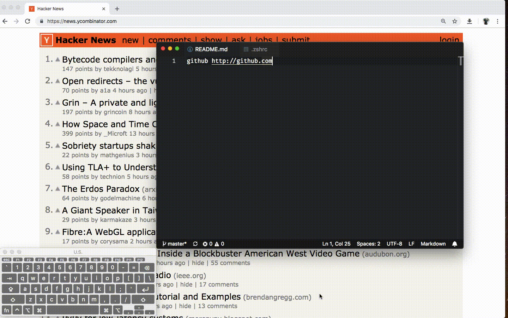

# SelectionJedi
*Dedication to @Y4m1n for her 24th birthday.*

An Alfred workflow to simplify your daily tasks with one shortcuts.

## Features
**You can watch this repo for releases only!**
### Search text, open url, open file path(s)

Select text and press <kbd>alt</kbd> + <kbd>alt</kbd>
- Open url(s)
  - [x] Get all urls from selection text
  - [ ] Improve url regular expression
  - [ ] Deal non-ASCII charachers
  - [ ] Check top level domain
- Search in default browser
  - [x] Single word
  - [x] Multiple word
- [ ] Reveal file(s)/folder(s) in Finder

## Relative works
- [TerminalMaster](https://github/willbchang/TerminalMaster)
- [EditorPadawan](https://github/willbchang/EditorPadawan)
- [DevYoungling](https://github/willbchang/DevYoungling)

## Credit

Icons made by <a href="https://www.flaticon.com/authors/those-icons" title="Those Icons">Those Icons</a> from <a href="https://www.flaticon.com/" 			    title="Flaticon">www.flaticon.com</a> is licensed by <a href="http://creativecommons.org/licenses/by/3.0/" 			    title="Creative Commons BY 3.0" target="_blank">CC 3.0 BY</a>
